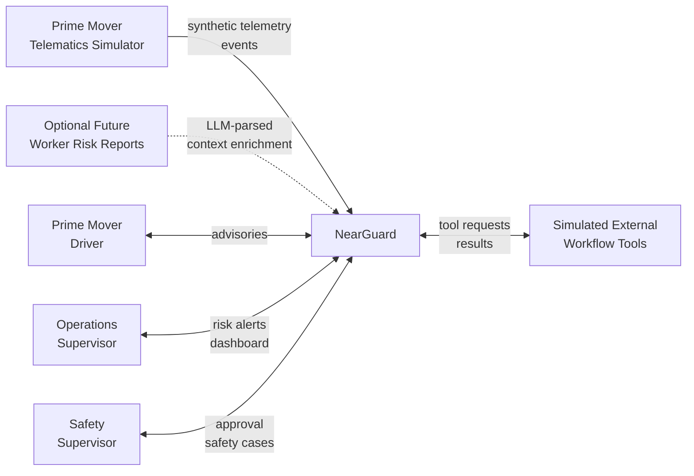
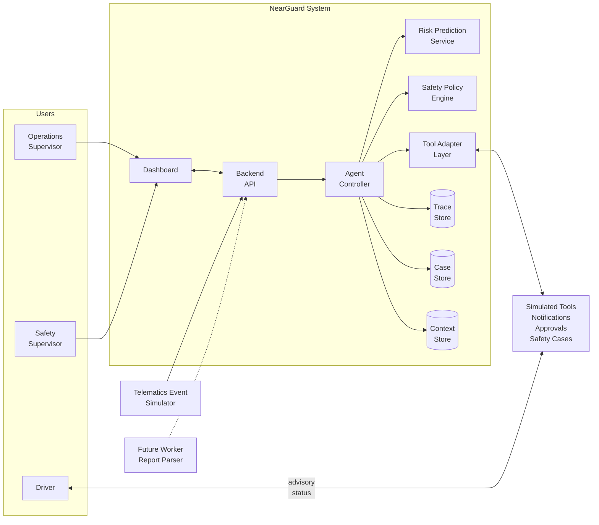
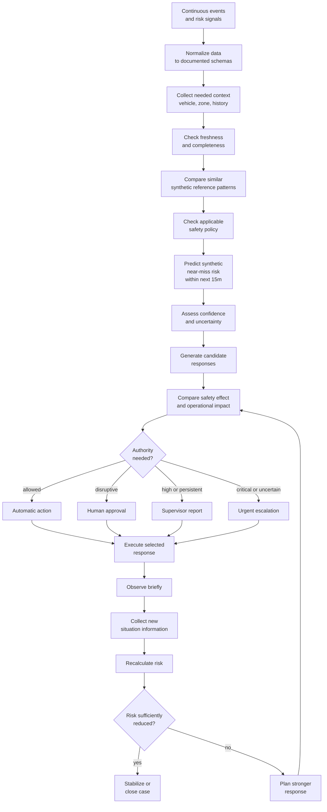
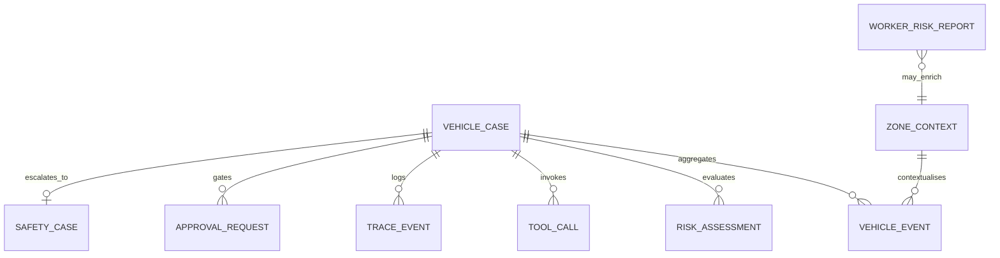
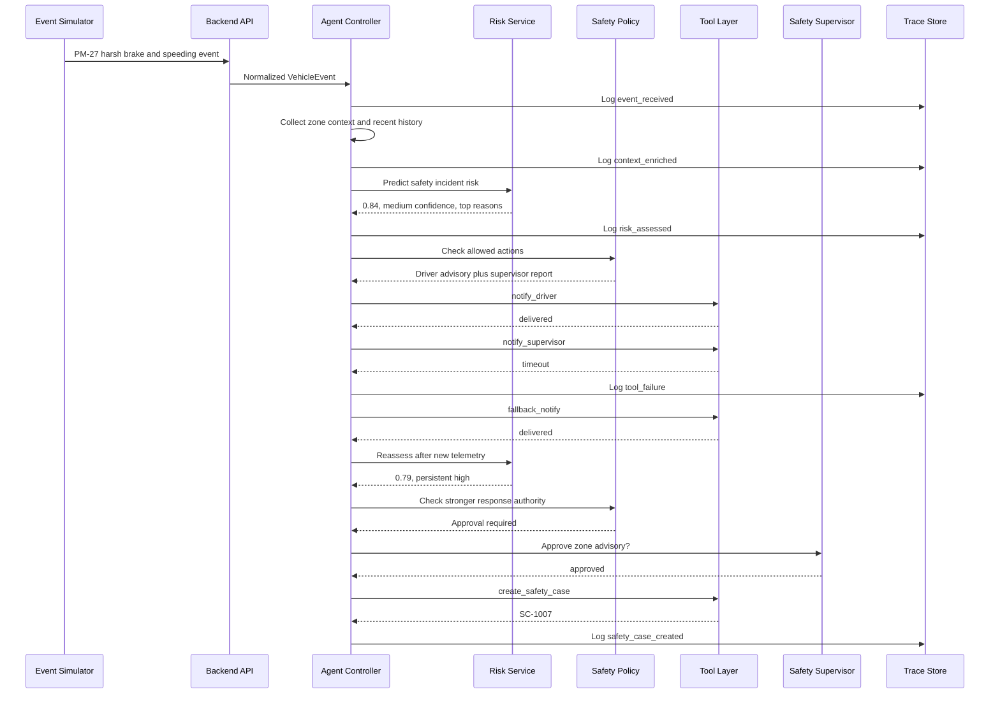

# NearGuard System Design Document

## Document Control

| Field | Value |
| --- | --- |
| Title | System Design Document for NearGuard |
| Version | 0.2 |
| Status | Draft |
| Product Name | NearGuard |

## 1. Project Overview And Goals

NearGuard is a prototype human-in-the-loop safety agent for Prime Mover safety incident risk prevention. It consumes synthetic telematics events, enriches them with zone and operational context, predicts elevated synthetic near-miss risk over a future horizon, applies deterministic safety policy, orchestrates simulated operational tools and records a complete execution trace.

Near-miss prevention is one high-priority use case. The broader risk target is safety incident risk, covering near-miss, speeding infringement, pedestrian exposure, collision and unsafe operating condition scenarios.

Design goals:

- Make the agentic loop visible end to end.
- Keep synthetic Prime Mover telemetry as the MVP primary live input.
- Use rolling telemetry windows to demonstrate future-horizon risk prediction.
- Use public PSA safety materials as context and scenario inspiration.
- Keep safety-sensitive actions approval-gated.
- Make risk explanations and trace logs inspectable.
- Separate risk prediction from agent decision policy.
- Avoid claims of live PSA integration, production prediction accuracy or implementation of internal PSA RAM/HEMP processes.

## 2. Public PSA Context

NearGuard references public PSA Singapore materials to ground the problem framing and demo scenarios:

- PSA Singapore Guidelines & Circulars: https://www.singaporepsa.com/resources/port-users/guidelines/
- PSA Singapore Health Safety & Security: https://www.singaporepsa.com/our-commitment/health-safety-security/
- HSS Rules for Port Users.
- Slow Down Zone (25km/h) along Pasir Panjang Terminal Link circular.
- Review of PSA Safety Infringements circular.
- Review of Pedestrian Movement at Wharf circular.

These sources indicate that driver safety, speed limits, responsible driving, pedestrian movement, PPE, unsafe conditions, safety surveillance and hazard reporting are relevant safety concerns in port operations. NearGuard uses them to shape demo variables, zone contexts and policy examples only. They are not treated as proprietary PSA operating procedures, real incident records, internal risk labels or production deployment requirements.

PSA RAM, HEMP and ALARP are treated as conceptual alignment only: NearGuard supports continuous risk reduction and escalation, but does not implement or claim PSA's internal matrix or process. If internal details were later provided and approved, model outputs could be mapped into an organization-specific risk framework.

## 3. Architecture

### 3.1 System Context Diagram



### 3.2 Container Diagram



### 3.3 Component Responsibilities

| Component | Responsibility |
| --- | --- |
| Synthetic Event Stream | Generates realistic Prime Mover events for scripted demo scenarios. |
| Event Ingestion | Validates event shape, normalizes fields and attaches events to active vehicle cases. |
| Context Enricher | Joins vehicle events with zone context, public-PSA-inspired restrictions and recent vehicle history. |
| Feature Aggregator | Builds model-ready features from recent 5/10/30-minute behavioural windows, context and case state. |
| Risk Prediction Service | Produces synthetic near-miss risk evidence for the next 15 minutes, confidence, uncertainty reason and top risk reasons. |
| Safety Policy Engine | Maps model evidence, confidence, uncertainty and operational impact to allowed action classes. It remains the intervention authority. |
| Agent Controller | Runs observe, normalize, enrich, validate, predict, decide, act, monitor, reassess and escalate loop. |
| Tool Layer | Provides simulated external actions and intentional failure paths. |
| Trace Logger | Persists chronological trace events for audit and demo display. |
| Dashboard | Shows active cases, explanations, pending approvals, tool status and execution trace. |
| Worker Report Parser | Optional future LLM component that extracts structured context from plain-language reports. |

## 4. Agentic Safety Loop

NearGuard follows a continuous safety-agent loop. The system does not stop after one prediction; it watches for updated context, reassesses the case and escalates if the situation does not improve.



### 4.1 Authority Classes

| Class | Meaning | Example |
| --- | --- | --- |
| Automatic action | Low-impact action the prototype may execute directly. | Driver advisory or continued monitoring. |
| Human approval required | Disruptive or safety-sensitive action. | Zone advisory, rerouting recommendation or operational intervention. |
| Supervisor report required | High or persistent risk that needs operational awareness. | Supervisor notification with risk summary and reasons. |
| Urgent escalation required | Critical or low-confidence high-risk situation. | Safety supervisor escalation with uncertainty reason. |

## 5. Data Design

### 5.1 Data Relationship Diagram



### 5.2 Data Sources And Roles

| Entity | Role | Model Input? |
| --- | --- | --- |
| `VehicleEvent` | Primary synthetic live telemetry event input. | Yes, after validation and aggregation. |
| `ZoneContext` | Zone-level operational and public-PSA-inspired context. | Yes, joined by `zone_id`. |
| `VehicleCase` | Current case state managed by the agent. | Partly; previous risk and trend may be used. |
| `RiskAssessment` | Prediction output for a specific evaluation time and future horizon. | No. |
| `TraceEvent` | Audit trail for decisions, model outputs, tool calls, approvals and failures. | No. |
| `ToolCall` | Simulated operational tool execution record. | No. |
| `ApprovalRequest` | Human approval state. | No. |
| `SafetyCase` | Escalated case summary and evidence. | No for MVP; future labelled feedback only if approved. |
| `WorkerRiskReport` | Optional future plain-language hazard report. | Not directly; LLM-extracted context may enrich `ZoneContext`. |

### 5.3 Core Schemas

```text
VehicleEvent
event_id
timestamp
vehicle_id
zone_id
event_type
speed
speed_limit
gps_freshness
```

```text
ZoneContext
zone_id
zone_name
traffic_level
weather
zone_historical_risk
restriction_level
slow_down_zone_active
pedestrian_exposure
```

```text
VehicleCase
case_id
vehicle_id
status
current_risk
previous_risk
confidence
risk_reasons
recommended_action
pending_approval
created_at
updated_at
```

```text
RiskAssessment
assessment_id
case_id
safety_incident_risk_score
confidence
uncertainty_reason
top_risk_reasons
created_at
```

```text
TraceEvent
trace_id
case_id
timestamp
event_type
message
metadata
```

```text
WorkerRiskReport
report_id
timestamp
reporter_role
zone_id
vehicle_id
description
extracted_context
extraction_confidence
```

### 5.4 Prediction Feature Set

| Category | Fields | Purpose |
| --- | --- | --- |
| Raw telemetry | `speed`, `speed_limit`, `event_type`, `zone_id`, `gps_freshness` | Captures the latest vehicle event. |
| Enriched context | `traffic_level`, `weather`, `zone_historical_risk`, `restriction_level`, `slow_down_zone_active`, `pedestrian_exposure` | Adds operational and zone-level context. |
| Derived features | `speed_over_limit`, `speed_over_limit_band`, `recent_harsh_brake_count_10m`, `recent_sharp_turn_count_10m`, `previous_risk`, `risk_trend` | Converts event stream and case state into model-ready signals. |
| Model outputs | `safety_incident_risk_score`, `confidence`, `uncertainty_reason`, `top_risk_reasons` | Prediction and explanation results. |
| Operational fields | `recommended_action`, `pending_approval`, `tool_calls`, `trace` | Used by the agent workflow, not the MVP risk model. |

### 5.5 Field Meaning And Use

| Field | Type / Range | Source | Used For |
| --- | --- | --- | --- |
| `speed` | 0-50 km/h for demo | VehicleEvent | Model input and speed-over-limit feature. |
| `speed_limit` | 15, 25 or 40 km/h in scripted demo | VehicleEvent / ZoneContext | Model input and safety-policy check. |
| `event_type` | Controlled enum | VehicleEvent | Model input and trace explanation. |
| `gps_freshness` | `fresh`, `delayed`, `stale` | VehicleEvent | Model input and confidence adjustment. |
| `traffic_level` | `low`, `medium`, `high` | ZoneContext | Model input. |
| `weather` | `clear`, `rain`, `heavy_rain` | ZoneContext | Model input. |
| `zone_historical_risk` | 0.0-1.0 synthetic baseline | ZoneContext | Model input. |
| `restriction_level` | `normal`, `caution`, `restricted`, `wharf` | ZoneContext | Model input and policy check. |
| `slow_down_zone_active` | boolean | ZoneContext | Model input and policy check. |
| `pedestrian_exposure` | `low`, `medium`, `high` | ZoneContext | Model input and risk reason. |
| `speed_over_limit` | numeric km/h | Derived | Model input. |
| `speed_over_limit_band` | `none`, `minor`, `moderate`, `severe` | Derived | Model input and explanation. |
| `recent_harsh_brake_count_10m` | integer 0+ | Derived | Model input. |
| `recent_sharp_turn_count_10m` | integer 0+ | Derived | Model input. |
| `previous_risk` | 0.0-1.0 | VehicleCase | Model input for trend. |
| `risk_trend` | `decreasing`, `stable`, `increasing` | Derived | Policy and escalation. |

## 6. AI And Decision Design

### 6.1 Tabular Risk Model

The primary model is a tabular ML risk model using scikit-learn gradient boosting. It predicts `near_miss_within_next_15m` from rolling telemetry windows, enriched context and derived features. The served `safety_incident_risk_score` is synthetic decision-support evidence for app compatibility, not a validated accident probability. In the prototype, training data and labels are synthetic demo constructs.

`docs/ai_and_data.md` is the source of truth for the prototype training recipe, feature encoding, synthetic label approach, confidence handling, explanation strategy and production-readiness boundaries.

Model outputs:

- `safety_incident_risk_score`: 0.0-1.0 score.
- `confidence`: `high`, `medium` or `low`.
- `uncertainty_reason`: missing context, stale GPS, conflicting signals or sparse history.
- `top_risk_reasons`: human-readable reasons derived from feature contribution or rule-aligned explanation.

### 6.2 LLM Role

The LLM is optional and bounded:

- It may summarize safety cases and trace events for supervisors.
- It may parse future `WorkerRiskReport.description` text into structured context fields.
- It must not directly set the final risk score.
- It must not approve or execute disruptive safety actions.
- Low-confidence extraction must be flagged for human review or ignored by the MVP model.

Example future extraction:

```json
{
  "description": "Near the wharf, drivers have poor visibility around the container stack and workers are crossing often.",
  "extracted_context": {
    "hazard_type": "visibility_issue",
    "pedestrian_exposure": "high",
    "reported_severity": "medium"
  },
  "extraction_confidence": "medium"
}
```

### 6.3 Safety Policy

The safety policy engine is deterministic. It uses the model output and operational context to choose an action class.

| Risk State | Policy Response |
| --- | --- |
| Low risk, high confidence | Monitor. |
| Medium risk | Send driver advisory. |
| High risk | Notify driver and supervisor. |
| Persistent high risk | Request human approval for stronger intervention. |
| Critical or low-confidence high risk | Urgently escalate with uncertainty reason. |

## 7. Tool Design

| Tool | Input | Output | Failure To Demonstrate |
| --- | --- | --- | --- |
| `get_vehicle_state` | `vehicle_id` | speed, location, telemetry freshness | stale GPS |
| `get_zone_risk` | `zone_id` | zone risk, traffic level, restriction context | unavailable zone context |
| `notify_driver` | vehicle and message | delivered or failed | delivery failure, timeout |
| `notify_supervisor` | supervisor and summary | delivered or failed | delivery failure, timeout |
| `request_human_approval` | action and rationale | approved or rejected | pending approval |
| `create_safety_case` | case evidence | safety case ID | creation failure |
| `recommend_zone_advisory` | zone and advisory | advisory recommendation | approval required |

## 8. Quality Attributes

### 8.1 Auditability

NearGuard must make each decision reviewable. The trace must show ordered input events, context lookup, model outputs, policy decisions, tool calls, failures, approvals and results.

### 8.2 Reliability Under Tool Failure

NearGuard should not stop silently when a tool call fails. The demo must include a supervisor notification timeout, record it in the trace and use retry, fallback or escalation.

### 8.3 Safety

NearGuard avoids over-autonomy. Driver advisories and supervisor notifications can be automated in the prototype. Disruptive actions such as zone advisory, rerouting or operational changes require approval. ML output is evidence only; deterministic safety policy and human authorization control interventions.

### 8.4 Claim Discipline

Documentation and narration must make clear that NearGuard uses synthetic data and public context only. It does not claim PSA production performance, live integration, internal RAM/HEMP implementation or real incident-label training.

### 8.5 Security And Privacy

The prototype uses synthetic vehicle, case, report and user identifiers. It does not require live PSA credentials, real driver identities or production operational access. In a future production design, approval actions, notification tools and trace visibility should be role-scoped so drivers, operations supervisors and safety supervisors only see the information needed for their responsibilities.

### 8.6 Scalability

The architecture separates event ingestion, context enrichment, feature aggregation, risk prediction, safety policy, tool orchestration and trace logging. This keeps the prototype aligned with larger operational volumes because event processing can be batched or streamed, tabular model inference can remain bounded, and LLM use can be limited to optional report parsing or summarisation rather than every telemetry event.

### 8.6 Future Vehicle-Person Interaction Lens

The MVP does not assume real-time person localization. If approved person-position data becomes available later through CCTV analytics, RTLS or wearables, NearGuard can add a deterministic interaction-risk lens for distance, trajectory conflict, TTC and stopping margin. That future lens should be labelled separately from the telemetry model and must not claim live PSA integration in the current prototype.

## 9. Main Sequence Flow



## 10. Implementation Notes

- Keep the first implementation vertical: one scripted scenario should work end to end before adding more scenarios.
- Use `docs/implementation_plan.md` as the source of truth for scaffold, module boundaries, artifact contracts, API contracts, tests and build order.
- Use `docs/ai_and_data.md` as the source of truth for synthetic variables, scenario construction, ML training methodology and risk explanation boundaries.
- Prefer deterministic policy rules for intervention decisions.
- Make the dashboard trace visually prominent.
- Build one intentional failure path early so agentic behaviour is visible.
- Keep worker reports behind an optional/future boundary unless the MVP scope changes.
